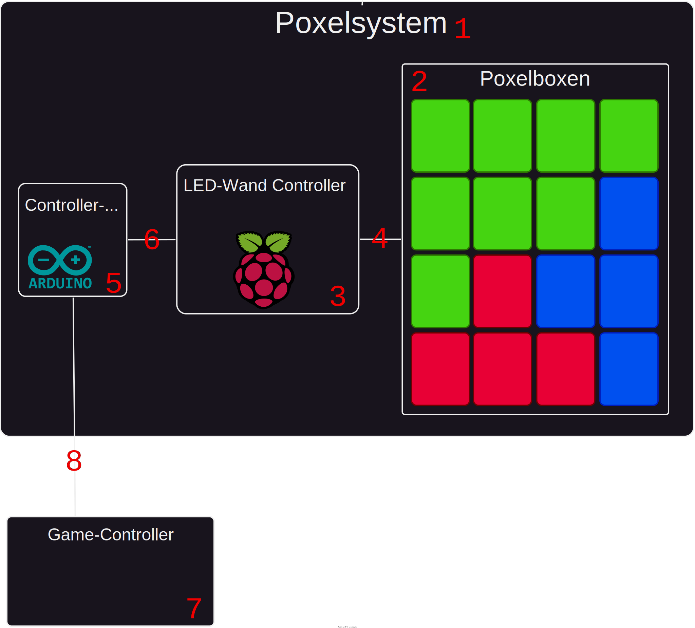
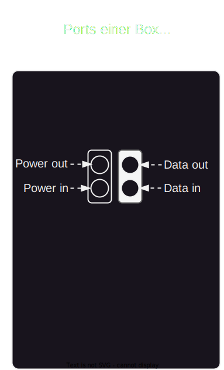

# Poxelbox

Die Poxelbox ist ein Modulares **36-Boxen LED-System**, welches über das WS2812B-Protokoll angesteuert und mittels eines Raspberry-Pi kontrolliert wird.

Mithilfe von eigenen Kontrollern kann man auf dieser LedWand verschiedene Retro-Spiele spielen.

## Repos
Hier ist der einfachheitshalber eine listung aller Repositorys, welche aktuell zur Proxelbox gehören:

|Name|Beschreibung|
|-|-|
|[Dokumentation](https://github.com/artandtechspace/Poxelbox-Dokumentation)|Dieses Repository mit der Hauptdokumentation über das gesamte Projekt|
|[Controller-Adapter](https://github.com/artandtechspace/Poxelbox-Controller-Adapter)|Software für den Controller-Adapter|
|[Haupt-Software](https://github.com/artandtechspace/Poxelbox)|Software, welche die Spiele/Animation etc. bereitstellt und sozusagen das Hirn ist.|
|[Java-Config-Tool](https://github.com/artandtechspace/Poxelbox-Configtool-Java)|Java-application zur Konfiguration der Poxelbox|
|[Web-Config-Tool](https://github.com/artandtechspace/Poxelbox-Configtool-Web)|Webapp zur Konfiguration der Poxelbox|

## Übersicht

Der Poxelbox-Aufbau sieht so aus:

Im Normalfall ist das Poxelsystem `1` geschlossen zusammen angebracht und regengeschützt.

### Poxelboxen
Mit Poxelboxen sind die einzellnen Boxen gemeint, welche zusammen als `Poxelbox[] (2)` bzw. `PoxelboxArray (2)` das "Display" darstellen.

Mehr zum Aufbau des `Poxelbox[] (2)` findet man [hier](../Aufbauen.md)

Die Verkabelung der Boxen erfolgt mittels 3-Pin DMX-Kabel, welches auch genutzt wird um die Verbindung `(4)` zum `LED-Wand-Controller (3)` herzustellen. Über dieses DMX-Kabel läuft das WS2812B-Protokoll

### LED-Wand-Controller (3)
Der `LED-Wand-Controller (3)` besteht aus einem Raspberry-PI und ist das Hirn des Systems.

Er wird über die GPIO-Pins des Raspberry-Pi's an den `Poxelbox[] (2)` angeschlossen und über das WS2812B-Protokoll gesteuert.

Hier wird die Hauptsoftware ausgeführt, welche den `Poxelbox[]` ansteuert, spiele Bereitstellt und den Schnittstelle zur Konfiguration der Poxelbox.

*In der Software-Section unterhalb wird diese genauer beschrieben.*

Damit die Spieler über einen Controller auf die Poxelbox zugreifen können, wird der `Controller-Adapter (5)` gebracht.

### Controller-Adapter (5)

Der `Controller-Adapter (5)` ist ein Arduino-Nano-Board, welcher über ein USB-Kabel am Debug-Port an einen der USB-Ports des `LED-Wand-Controller (3)` gesteckt wird.

**Wichtig: Damit der Controller-Adapter funktioniert, muss er das einzige USB-Gerät am `LED-Wand-Controller (3)` sein, da er sonst nicht Identifiziert werden kann**

Am `Controller-Adapter (5)` ist über Jumper-Kabel außerdem noch mit einem RJ45-Stecker verbunden, welcher zum `Game-Controller (7)` über ein LAN-Kabel `(8)` verbunden wird. Dies wird nur genutzt um die Knöpfe des `Game-Controllers (7)` abzufragen.

*Der Erfahrung nach sollte das Kabel maximal 3 Meter länge haben, da längere Kabel zu größe Verluste in der Übertragung haben*

### Game-Controller (7)

Ein modifierter NES-Controller, welcher über ein Ethernet-Kabel `(8)` (Aber nicht dem Ethernet-Protokoll) an den `Controller-Adapter (5)` angeschlossen ist.

## Software

Grundlegend besteht die Poxelbox aus folgenden Software-Systemen, welche wie folgt miteinander Kommunizieren:

**Für die Software-Produkte liegt im jeweiligen Git-Repo selber eine Anteilung zum Aufsetzen der Debug/Develop Umgebung, daher wird dies hier vernachlässigt!**

### Haupt-Software (3)

[Hier](https://github.com/artandtechspace/Poxelbox) findet man das Github-Repo der Hauptsoftware.

Die Hauptsoftware ist in Python3 geschrieben und für folgendes zuständig:

#### Ansteuerung der Poxelboxen
Über die GPIO-Pins des Raspberry-Pi's wird über das WS2812B-Protokoll das "Display" angesteuert.

Folgende Pins werden hierbei genutzt:

* 5V: Logic-Level-Spannung
* GND: Ground
* D12: Datenübertragung

#### Kommunizieren mit dem Controller
Über den Controller-Adapter, welcher mittels USB am Raspberry-Pi angeschlossen ist (Mehr dazu im Übersicht's-Teil), werden Befehle von den Controllern/Spielen angenommen

#### Bereitstellung der Spiele und Animationen
Die `Hauptsoftware (3)` stellt verschiedene Spiele und Animationen bereit, welche über die Poxelbox (ab)gespielt werden können.

#### Bereitstellung der Config-Schnittstelle
Zur externe Konfiguration ohne Bildschirm, Tastatur, etc. an den Pi anschließen zu müssen, stellt die `Hauptsoftware (3)` auch eine Http-Config-Schnittstelle zur Verfügung, welche über ein Konfigurationstool angesprochen werden kann.

Aktuell gibt es verschiedene Konfigtools, welche mit dieser Http-Schnittstelle kommunizieren können.

Alle diese Tools werden auch hier im Software-teil separat erklärt.

Eine Liste der Konfigurationseinstellungen mit Erklärungen findet man in der unteren Sektion `Konfiguration der Haupt-Software`.

#### Hosten des Web-Config-Tool
Für mehr Infos hierzu bitte in die eigene Software-Sektion für das Web-Config-Tool schauen

### Controller-Adapter (7)

[Hier](https://github.com/artandtechspace/Poxelbox-Controller-Adapter) findet man das Github-Repo des Controller-Adapters

Über einen Rj45-Stecke (**Nicht über Ethernet nur über diesen Stecker**) ist der `Controller-Adapter (7)` mit dem `Game-Controller (8)` verbunden.

Und über USB mit der `Haupt-Software (3)` des `LED-Wand-Controller (2)`.

**Wichtig: Damit der Controller-Adapter funktioniert, muss er das einzige USB-Gerät am `LED-Wand-Controller (2)` sein, da er sonst nicht Identifiziert werden kann**

Im NES-`Game-Controller (8)` ist ein Shift-register verbaut, welches alle Knöpfe des Controllers einliest. Dieses wird über den RJ45-Stecke direkt an den Controller-Adapter gemapped, welcher es einließt, interpretiert und als Spielersignal an die `Haupt-Software (3)` weitergibt.

### Web-Config-Tool (4)
[Hier](https://github.com/artandtechspace/Poxelbox-Configtool-Web) findet mand as Github-Repo des Web-Config-Tool's

Das `Web-Config-Tool (4)` ist zwar eine separate Software und wird nicht als Teil der `Haupt-Software (3)` gesehen. Jedoch wird ein Build von dieser immer über den Haupt-Software-Webserver, welcher auch die Config-Schnittstelle stellt, gehostet. Sprich sobald man Netzwerkzugriff zur `Haupt-Software (3)` hat, wird man automatisch bei einem Webseitenaufruf (Http-Request) auf das Web-Config-Tool weitergeleitet.

*Für Informationen zu Konfigurationsmöglichkeiten bitte in die Sektion `Konfigurationen` schauen*

Auch wenn das Web-Config-Tool nicht von der `Haupt-Software (3)` abgerufen und separat gehostet wird, kann es auf die Config-Schnittstelle der `Haupt-Software (3)` zugreifen.

Dazu muss nur der `Advanced Mode` aktiviert werden und in der sich öffnenden Sektion der Endpunkt auf den Server mit der `Haupt-Software (3)` geändert werden.

### Java-Config Tool (6)
[Hier](https://github.com/artandtechspace/Poxelbox-Configtool-Java) findet mand as Github-Repo des Java-Config-Tool's

**DEPRECATED: Weitere Nutzung nicht empfohlen**

Im gegensatz zum Web-Config-Tool muss das Javatool selber installiert werden und die Schnittstelle der `Haupt-Software (3)` angeben sein. Nach der Verbindung kann man dann die Einstellungen bearbeiten. Aufgrund dieses Nachteils wird das Java-Config-Tool nicht mehr weiterentwickelt.

## Konfiguration der Haupt-Software
Wie oberhalb bereits beschrieben kann man über verschiedene Tools die Haupt-Software konfigurieren.

Nach jedem Speichern der Einstellungen im System, **startet die Haupt-Software neu** um alle Einstellungen korrekt zu übernehmen.

Heißt nach jedem Speichern muss man sich bei den Config-Tools neu mit dem System verbinden.

Im folgenden wird jede Einstellung erläutert.

### General-Settings
#### Is Dev-Environment?
Die Haupt-Software kann in zwei verschiedenen Modi laufen. In der Entwicklungsumgebung (Dev-Environment) wird das Hauptprogramm, die Spiele und Animationen nicht über die Poxelbox, sprich andere Hardware, angezeigt. Sondern über Py-Game als Fenster simuliert. Weiter erfolgen auch die Eingaben der Spieler nicht über einen externen Controller, sondern über Pygame.

Sprich ist diese Einstellung aktiviert, wird keine externe Hardware der Poxelbox gebraucht um die Software zu entwickeln.

#### PyGame-Pixel-Scale
Im Verbund mit der obrigen Einstellung wird hier festgelegt wie viele PyGame-Pixel einen Poxelbox-Pixel darstellen.

#### Esp-Baud
In der Produktionsumgebung, also mit der Poxelbox-hardware, kommuniziert der `Controller-Adapter` mit der hier angegebenen BAUD-Rate.

*Diese Eigenschaft heißt aufgrund von früheren Planungen Esp-Baud und nicht Controller-Adapter-Baud (Legacy)*

#### Use test scene?
Zum testen der Poxelbox und zur Fehlersuche gibt es diesen Modus. Er startet nicht das Hauptprogram mit den Spielen und Animationen. Sondern es läuft nur eine Animation durch, die Reihen von unten nach oben aufbaut, welche von links nach rechts mit Rot, Grün oder Blau aufgefüllt werden.

Zum Beispiel kann sie genutzt werden um die Verkabelung der Boxen zu Prüfen.

#### Wall-Size (X/Y):
Diese beiden Einstellungen geben an wie viele von den Poxelboxen, **nicht Pixeln, Boxen** aufgebaut sind. X ist die Breite, Y ist die Höhe.

#### Flip each Box over Y-Axis or X-Axis:
Zur Korrigiert die Ansteuerung der Boxen.
Wenn die Boxen anders gedreht sind als in den Beispiel der Sektion `Aufbau der Poxelboxen
` kann mit diesen Schaltern die X/Y-Orientierung der Boxen algemein geändert werden.

### Spiele und Animationen
Für alle Spiele und Animationen kann man einstellen ob diese aktiviert sind oder nicht. Nicht aktivierte Spiele/Animationen werden im Hauptmenu der Software nicht angezeigt und können somit nicht geladen werden.

Hilfreich, wenn man die Poxelbox in einer größe aufbaut, welche von einem der Spiele/Animationen nicht unterstützt wird.

## Aufbau der Poxelboxen
Die Boxen der Poxelboxen müssen eine Rechteckige Box ergeben.
Die Poxelboxen können beliebig rotiert werden, solange alle gleich ausgerichtet sind.

Die Standartrotationen und Datenkabel-Verkabelung sind auf folgenden Bildern anzuschauen:

**Die folgenden Ansichten sind von Hinten auf die Poxelbox geschaut**

Zur Referenz stehen hier außerdem noch die Ports:

Sollten die Boxen in einer anderen Orientierung aufgebaut sein, können diese über die Konfig gedreht werden. Mehr dazu in der Sektion `Konfiguration der Haupt-Software` oberhalb.

Der Anschlusspunkt des RaspberryPi (Daten-Eingang) ist bei jedem Aufbau der Boxen immer unten Rechts.

*Es ist darauf zu achten, dass jede Box mit Energie/Power versorgt wird. Hierbei muss allerdings keine Reihenfolge bei den Boxen eingehalten werden.*
